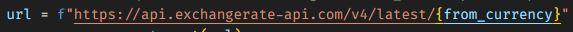
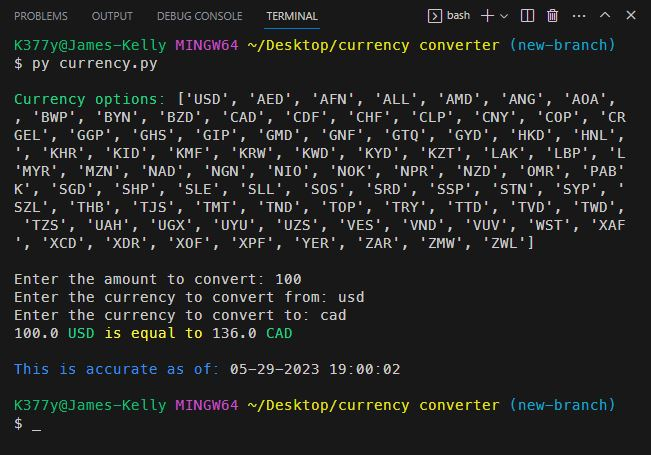

# Currency Converter

## Description
This Python application takes a current amount of money (inputed by the user) and converts it to another currency value (161 currencies from 200 countries) by making an API call documented in this website => https://www.exchangerate-api.com/docs/python-currency-api. This API provides fairly accurate results and is updated daily from what I'm able to see on their site.
 
 

### ***Some notes about the Python datetime module:*** 
 - Importing datetime allows you to create datetime objects, manipulate dates and times, and perform various operations related to date and time calculations. 
 - It provides methods to extract specific components from a date or time, such as year, month, day, hour, minute, and second. 
 - With datetime, you can handle tasks such as calculating time differences, parsing date strings into datetime objects, and generating timestamps for specific dates and times. 
 - The datetime module is used in this project to convert the UNIX timestamp value to local time and also to string format it for display purposes to show when the data was last updated. 

### ***Some notes about the Python requests module:*** 
 - Allows for the use of sending http methods such as 'GET', 'POST', 'PUT', 'DELETE', etc. The response from the server can be accessed through the 'Response' object. 
 - This module allows us to pass query parameters and request data. 

### ***Some notes about the Python json module:*** 
 - The json module allows you to encode (serialize) Python objects into JSON format and decode (deserialize) JSON data into Python objects. 
 - json.dumps() is used to convert a Python object into a JSON string representation. 
 - json.loads() is used to parse a JSON string and convert it back into a Python object. 
 - The module supports pretty printing of JSON data for better readability using the json.dumps() function with the indent parameter. 

### ***Some notes about the Python f-strings:*** 
 - The f-string is basically the Javascript equivalent of a template literal (created with backticks) which allows the embedding of expressions within strings. 
 - In the example below, the f-string is used to embed the `from_currency` value into the url for the API request. 

 

## *Installation & Usage*
To install this app, simply clone the repository and run the `currency.py` file in your terminal.
 
When prompted: 
 - Type the amount of currency you want to convert. 
 - Type the currency you are starting with. 
 - Type the currency you want to convert to. 
 - Then the value will be returned, along with a message of when the data was last updated (provided by the API). 
 

 
 

## *Questions*
<h3>Portfolio:&emsp;<a href="https://jk377y.dev" target="_blank">https://jk377y.dev</a></h3>
<h3>Email:&emsp;<a href="mailto:jk377y@gmail.com" target="_blank">jk377y@gmail.com</a></h3>
<h3>LinkedIn:&emsp;<a href="https://www.linkedin.com/in/james-kelly-software-developer/" target="_blank">https://www.linkedin.com/in/james-kelly-software-developer/</a></h3>
<h3>GitHub:&emsp;<a href="https://github.com/jk377y" target="_blank">https://github.com/jk377y</a></h3>
 
 

## *License*

 Copyright (c) 2023 James Kelly
 Information on this license can be found at: (https://opensource.org/licenses/MIT)